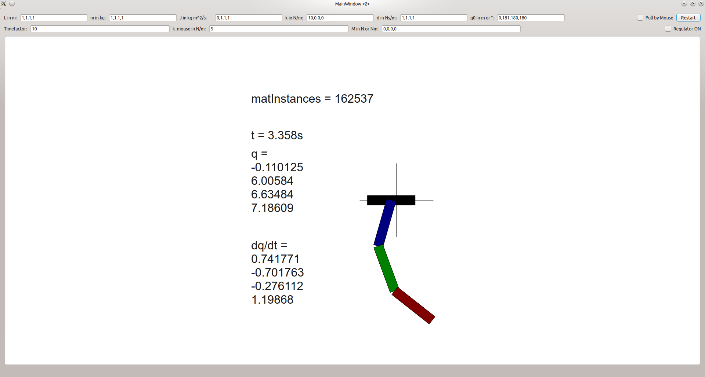

# Inverse Tripple Pendulum
This Qt-Application simulates and animates the motion of a 3-stick pendulum. 


# System
The system is build up with a carret, constraint to horizontal movement. Then a chain of 3 sticks is mounted onto
the carret. 

The calculation of the model is done in wxMaxima. 

# Features
- user defined masses, lengths and inertias, springs, dampings
- user defined initial coordinates
- user can drag the carret with the mouse, and try to balance the the inverse pendulum (easier with time lapse)
- user defined damping factors of each joint and for the carret
- slow motion by changing timefactor
- the springs are fixed to the initial relative angle between 2 linked sticks. 

# Not implemented
- a working regulator

# Usage
- set dampings to zero, and watch the chaotic movement. Is like a burning fire - you can watch it for ever without getting bored. :)
- Enable "Pull by Mouse", set Time-Factor to 10, and try to balance the pendulum. It works for about 3 seconds, then normally 
it is too instable for balancing any more. 

# Known Bugs
- memory leak (C++ has no garbage collector :) )
- numeric (hopefully numeric only) instability, when spring constants are high, and dampings are low. 

# TODO
- calculate and print system-energy (if it should not increase with time, without any input)
- improved numerical stable solver

# Compile & Run
Tested with Qt5.9 on Linux Mint 19 (based on Ubuntu 18.04)
```
mkdir build
cd build
qmake ..
make
chmod +x inverse-tripple-pendulum 
./inverse-tripple-pendulum 
```
